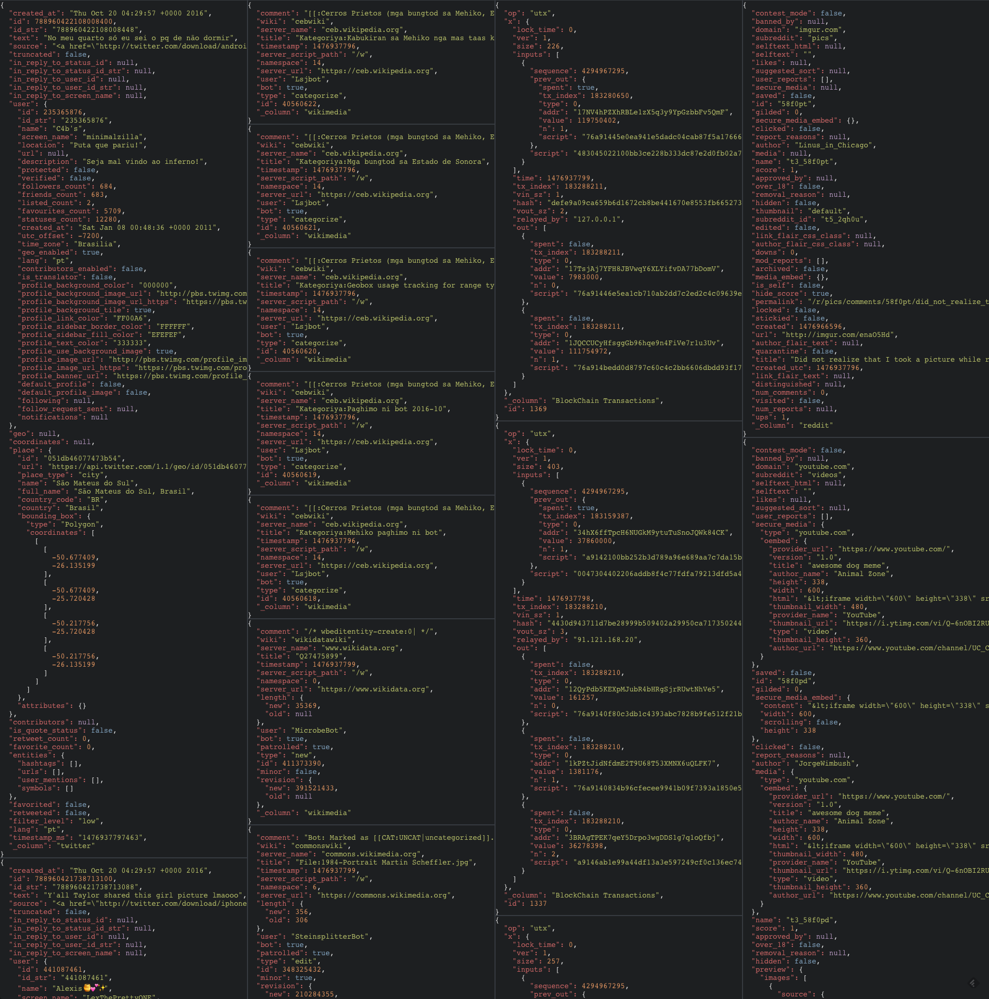

# ngJsonView
view JSON with syntax highlighting in angular. Inspired by ng-prettyJSON but read only for speed.
if you are interested in a versiont hat supports editing go here: https://github.com/darul75/ng-prettyjson



```html
<!-- include in the head of the html file-->
<link rel="stylesheet" type="text/css" href="css/ngjsonview.css">
<script src="./directives/ngjsonview.js"></script>
```

```javascript
//include it in your angular app
var app = angular.module('CardUI', ['ngjsonview']);
```

```html
<!-- use it-->
<ngjsoncollection d="arrayofobjectsinscope"></ngjsoncollection>
```